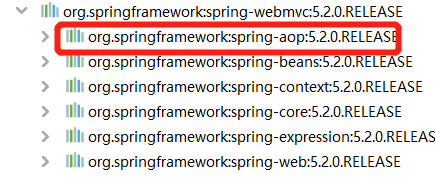
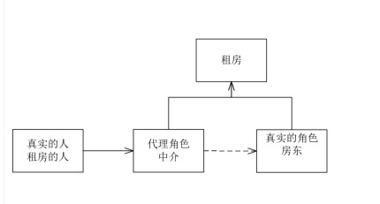
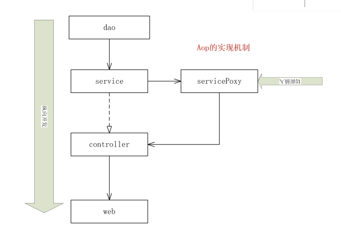
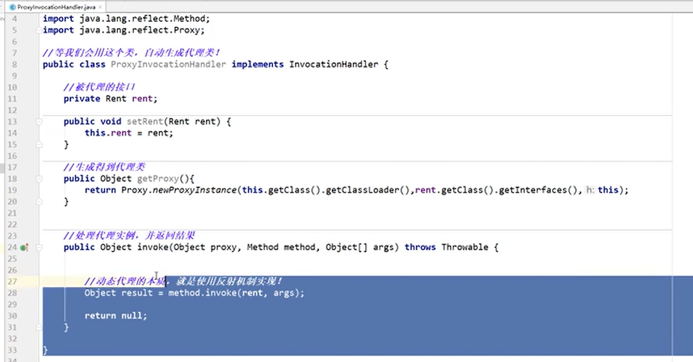
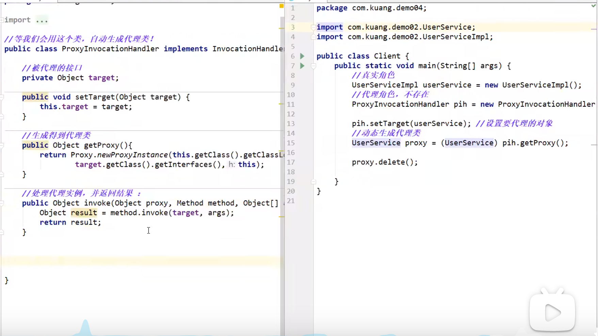
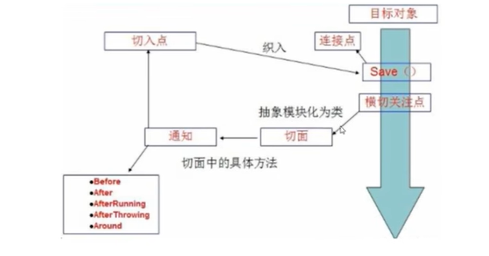
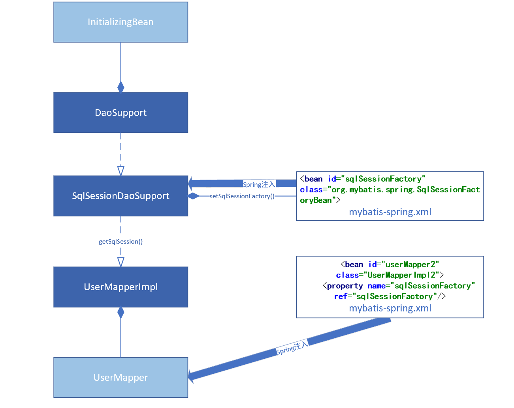

# spring

* 目的：解决企业应用开发的复杂性
* 使现有的技术更加容易使用
* 支持事务的处理，对框架整合的支持
* **Spring 是一个轻量级的控制反转 IoC  、 面向切面（AOP）的框架!**


# appliactionContext.xml

```xml
<?xml version="1.0" encoding="UTF-8"?>
<beans xmlns="http://www.springframework.org/schema/beans"
       xmlns:xsi="http://www.w3.org/2001/XMLSchema-instance"
       xmlns:context="http://www.springframework.org/schema/context"
       xmlns:p="http://www.springframework.org/schema/p"
       xmlns:c="http://www.springframework.org/schema/c"
       xsi:schemaLocation="http://www.springframework.org/schema/beans
        https://www.springframework.org/schema/beans/spring-beans.xsd
        http://www.springframework.org/schema/context
        https://www.springframework.org/schema/context/spring-context.xsd">

  <context:annotation-config/>

</beans>

```

# pom.xml
```xml
<?xml version="1.0" encoding="UTF-8"?>
<project xmlns="http://maven.apache.org/POM/4.0.0"
         xmlns:xsi="http://www.w3.org/2001/XMLSchema-instance"
         xsi:schemaLocation="http://maven.apache.org/POM/4.0.0 http://maven.apache.org/xsd/maven-4.0.0.xsd">
    <modelVersion>4.0.0</modelVersion>

    <groupId>org.example</groupId>
    <artifactId>spring-study</artifactId>
    <packaging>pom</packaging>
    <version>1.0-SNAPSHOT</version>
    <modules>
        <module>spring-01-ioc1</module>
        <module>spring-02-helloSpring</module>
        <module>spring-03-ioc2</module>
        <module>spring-04-DI</module>
        <module>spring-06-anno</module>
    </modules>

    <properties>
        <maven.compiler.source>8</maven.compiler.source>
        <maven.compiler.target>8</maven.compiler.target>
    </properties>

    <dependencies>
        <dependency>
            <groupId>org.springframework</groupId>
            <artifactId>spring-webmvc</artifactId>
            <version>5.2.0.RELEASE</version>
        </dependency>

        <dependency>
            <groupId>junit</groupId>
            <artifactId>junit</artifactId>
            <version>4.12</version>
        </dependency>
    </dependencies>

</project>
```


* set注入

  ```java
      private UserDao userDao;
  
      public void setUserDao(UserDao userDao){
         this.userDao = userDao;
      }
  
  ```
  
##注解开发

### 注解
* @Autowired 自动装配 firstByType,thenByName
  如果Autowired不能唯一自动装配上属性，则需要@Qualifier(value="xxx")
* @Resoure   自动装配 firstByName,thenByType
* @Nullable  标记在字段上，表示这个字段可以传为空
* @Component 标记在类上，表示这个类已经被Spring装配管理了,就是bean
* @Configuration 定义一个配置类，等价一个beans.xml

### 使用注解开发

在Spring4之后，要使用注解开发，必须要保证AOP包的导入


使用注解需要导入context约束，添加注解的支持。

1. bean
2. 属性如何注入
3. 衍生的注解
   @Component 有几个衍生注解，在web开发中，会按照mvc三层架构分成！
    * dao [@repository]
    * service [@Service]
    * controller [@Controller]
    这四个注解功能一样，代表将某个类注册到Spring中，装配bean
4. 自动装配
5. 作用域
6. 小结

   xml与注解:
    * xml更加万能，使用于任何场景，维护更加简单方便
    * 注解 不是自己类使用不了，维护相对复杂
    
   xml与注解的最佳实践：
    * xml用来管理bean;
    * 注解只负责完成属性的注入；
    * 我们在使用的过程中一定要开启注解的支持


## 使用Java的方式配置Spring

我们现在要完全不使用Springl的xml配置了，全权交给ava来做！
JavaConfig是Spring的一个子项目，在Spring4之后，它成为了一个核心功能！

* @Configuration 定义一个配置类，等价一个beans.xml 


# AOP
## 10.代理模式

为什么学习代理模式？
因为这是Spring AOP的底层！【SpringAOP SpringMVC】


代理模式分类：
* 静态代理
* 动态代理

### 10.1 静态代理
角色分析：
* 抽象角色：一般用接口或者抽象类来解决
* 真实角色： 被代理的角色
* 代理角色： 代理真实角色、代理真实角色后，一般会有一些附属操作
* 客户：访问代理对象的人

代理模式的好处：
* 可以使真实角色的操作更加纯粹！不用去关注一些公共的业务
* 公共也就就交给代理角色！实现了业务的分工！
* 公共业务发生扩展的时候，方便集中管理！

缺点：
* 一个真实角色就会产生一个代理角色：代码量会翻倍开发效率会变低

Aop切面理解



### 10.2 动态代理

* 动态代理和静态代理角色一样
* 动态代理的代理类是动态生成的，不是我们直接写好的！
* 动态代理分为两大类：基于接口的动态代理，基于类的动态代理 
  * 基于接口：JDK动态代理
  * 基于类：cglib
  * java字节码实现：javasist

需要了解两个类：Proxy代理 InvocationHandler调用处理

* InvovationHandler
  public interface InvocationHandler
  InvocationHandler是由代理实例的调用处理程序实现的接口，
  每个代理实例都有一个关联的调用处理程序，
  当在代理实例上调用方法时，方法调预将被编码并分派到其调用处理程序的invoke方法.



  
### 10.3 使用Spring实现Aop

Aop在Spring中的作用

提供声明式事务：允许用户自定义切面
* 横切关注点：跨越应用程序多个摸块的方法或功能，即是，与我们业务逻辑无关的，但是我们需要关注的部
分，就是横切关注点。如日志，安全，缓存，事务等等…
* 切面(ASPECT):横切关注点被模块化的特殊对像。即，它是一个类
* 通知(Advice):切面必须要完成的工作。即，它是类中的一个方法，
* 目标(Target):被通知对像。
* 代理(POy):向目标对象应用通知之后创建的对象。
* 切入点(PointCut):切面通知执行的“地点"的定义。
* 连接点(JointPoint):与切入点匹配的执行点.




#### 方式一 使用Spring的API接口 【主要是SPRING API接口实现】

```java
//主要是接口实现
public class Log implements MethodBeforeAdvice {

    //method 被代理的对象所拥有的方法
    // args 方法的参数
    // target 被代理的对象
    public void before(Method method, Object[] args, Object target) throws Throwable {
        System.out.println("[debug]" + target.getClass().getName() + "的" + method.getName() + "的方法即将被执行");
    }
}

public class AfterLog implements AfterReturningAdvice {
    public void afterReturning(Object returnValue, Method method, Object[] args, Object target) throws Throwable {}
}
    
```

```xml
    <!--注册bean-->
    <bean id="userService" class ="com.summer.service.UserServiceImpl"/>
    <bean id="log" class ="com.summer.log.Log"/>
    <bean id="afterLog" class ="com.summer.log.AfterLog"/>

    <!--配置AOP:需要导入AOP的约束-->
    <!--方式一:使用原生Spring API接口-->
    <!--配置AOP:需要导入AOP的约束-->
    <aop:config>
        <!--切入点-->
        <aop:pointcut id="pointcut" expression="execution(* com.summer.service.UserServiceImpl.*(..))"/>
        <!--执行环绕增加-->
        <aop:advisor advice-ref="log" pointcut-ref="pointcut"/>
        <aop:advisor advice-ref="afterLog" pointcut-ref="pointcut"/>
    </aop:config>
```
####  方式二 自定义来实现AOP 【主要是切面定义】

```xml
    <!--方式二：自定义类-->
    <bean id = "diy" class="com.summer.diy.DiyPointCut"/>

    <aop:config>
        <!-- 自定义切面，ref 要引用的类 -->
        <aop:aspect ref="diy">
            <!-- 切入点 -->
            <aop:pointcut id="point" expression="execution(* com.summer.service.UserServiceImpl.*(..))"/>
            <!-- 通知 -->
            <aop:before method="before" pointcut-ref="point"/>
            <aop:after method="after" pointcut-ref="point"/>
        </aop:aspect>
    </aop:config>
```

#### 方式三 使用注解实现  
```java
@Aspect
public class AnnotationPointCut {
    @Before("execution(* com.summer.service.UserServiceImpl.*(..))")
    public void before(){
        System.out.println("===========annotation方法执行前========");
    }

    @After("execution(* com.summer.service.UserServiceImpl.*(..))")
    public void after(){
        System.out.println("===========annotation方法执行后========");
    }

    @Around("execution(* com.summer.service.UserServiceImpl.*(..))")
    public void around(ProceedingJoinPoint joinPoint) throws Throwable {
        System.out.println("环绕前");
        Object proceed = joinPoint.proceed();
        System.out.println("环绕后");
    }
}
```
## 11.回忆Mybatis
1. 编写实体类
    ```java
   public class User {
    private Integer id;
    private String loginName;
    private String userName;
    private String password;
    private String sex;
    private String email;
    private String address;
    ```
   
2. 编写核心配置文件
    ```xml
   
    <?xml version="1.0" encoding="UTF-8" ?>
    <!DOCTYPE configuration
        PUBLIC "-//mybatis.org//DTD Config 3.0//EN"
        "http://mybatis.org/dtd/mybatis-3-config.dtd">
    <!-- configuration 核心配置文件 -->
    <!-- 配置文件的根元素 -->
    <configuration>

    <typeAliases>
        <package name="com.summer.pojo"/>
    </typeAliases>

    <!-- 环境：配置mybatis的环境 -->
    <environments default="development">
        <!-- 环境变量：可以配置多个环境变量，比如使用多数据源时，就需要配置多个环境变量 -->
        <environment id="development">
            <!-- 事务管理器 -->
            <transactionManager type="JDBC"/>
            <!-- 数据源 -->
            <dataSource type="POOLED">
                <property name="driver" value="com.mysql.jdbc.Driver"/>
                <property name="url" value="jdbc:mysql://127.0.0.1:3306/db_login?serverTimezone=UTC&amp;useUnicode=true&amp;characterEncoding=utf8&amp;useSSL=false"/>
                <property name="username" value="root"/>
                <property name="password" value="mysql123456"/>
            </dataSource>
        </environment>
    </environments>

    <!-- 映射器：指定映射文件或者映射类 -->
    <mappers>
        <mapper class="com.summer.mapper.UserMapper"/>
    </mappers>
    </configuration>
   ```
3. 编写接口
    ```java
    public interface UserMapper {
        public List<User> selectUser();
    }
    ```
4. 编写Mapper.xml
   ```xml
       <?xml version="1.0" encoding="UTF-8" ?>
       <!DOCTYPE mapper
        PUBLIC "-//mybatis.org//DTD Config 3.0//EN"
        "http://mybatis.org/dtd/mybatis-3-mapper.dtd">
   
   <mapper namespace="com.summer.mapper.UserMapper">
        <select id="selectUser" resultType="user" >
            select * from db_login.user;
        </select>

    </mapper>
   ```
5. 测试
    ```java
       public void test1() throws IOException {
        String resource = "mybatis-config.xml";
        InputStream inputStream = Resources.getResourceAsStream(resource);
        SqlSessionFactory sqlSessionFactory = new SqlSessionFactoryBuilder().build(inputStream);
        SqlSession sqlSession = sqlSessionFactory.openSession(true);

        UserMapper mapper = sqlSession.getMapper(UserMapper.class);
        List<User> userList = mapper.selectUser();

    for (User user : userList) {
      System.out.println(user);
      //
    }
    }
    ```

## 12. Spring整合Mybatis
### 方式一：sqlSessionTemplate
1. 编写实体类User
2. 编写 mybatis-config.xml
    * 只写别名和setting
3. 编写 mybatis-spring-dao.xml
    * 设置数据源
    * 注入 sqlSessionFatory,绑定Mabatis
    * 注入 sqlSessionTemplate

4. 编写接口UserMapper,及实现类 UserMapperImpl
    *UserMapperImpl中使用Spring中注入的sqlSessionTemplate
5. 编写UserMapper.xml
6. 测试


### 方式二：sqlSessionDaoSupport



## 13.声明式事务

### 1.回顾事务

* 把一组业务当成一个业务来做：要么都成功，要么都失败！
* 事务在项目开发中，十分的重要，涉及到数据的一致性问题，不能马虎！
* 确保完整性和一致性：
事务ACID原则：
* 原子性
* 一致性
* 隔离性
    *  多个业务可能操作同一个资源，防止数据损坏
* 持久性
  * 事务一旦提交，无论系统发生什么问题，结果都不会再被影响，被持久化的写到存储器中！

### 2. spring中的事务管理

* 声明式事务：AOP
* 编程式事务：需要再代码中，进行事务的管理

####思考：
为什么需要事务？
* 如果不配置事务，可能存在数据提交不一致的情况下：
* 如果我们不在SPRING中去配置声明式事务，我们就需要在代码中手动配置事务！
* 事务在项目的开发中十分重要，设计到数据的一致性和完整性问题，不容马虎！

```xml
AOP：【动态代理】
  		指在程序运行期间动态的将某段代码切入到指定方法指定位置进行运行的编程方式；
  
  1、导入aop模块；Spring AOP：(spring-aspects)
  2、定义一个业务逻辑类（MathCalculator）；在业务逻辑运行的时候将日志进行打印（方法之前、方法运行结束、方法出现异常，xxx）
  3、定义一个日志切面类（LogAspects）：切面类里面的方法需要动态感知MathCalculator.div运行到哪里然后执行；
  		通知方法：
  			前置通知(@Before)：logStart：在目标方法(div)运行之前运行
  			后置通知(@After)：logEnd：在目标方法(div)运行结束之后运行（无论方法正常结束还是异常结束）
  			返回通知(@AfterReturning)：logReturn：在目标方法(div)正常返回之后运行
  			异常通知(@AfterThrowing)：logException：在目标方法(div)出现异常以后运行
  			环绕通知(@Around)：动态代理，手动推进目标方法运行（joinPoint.procced()）
  4、给切面类的目标方法标注何时何地运行（通知注解）；
  5、将切面类和业务逻辑类（目标方法所在类）都加入到容器中;
  6、必须告诉Spring哪个类是切面类(给切面类上加一个注解：@Aspect)
  [7]、给配置类中加 @EnableAspectJAutoProxy 【开启基于注解的aop模式】
  		在Spring中很多的 @EnableXXX;
  
  三步：
  	1）、将业务逻辑组件和切面类都加入到容器中；告诉Spring哪个是切面类（@Aspect）
  	2）、在切面类上的每一个通知方法上标注通知注解，告诉Spring何时何地运行（切入点表达式）
   3）、开启基于注解的aop模式；@EnableAspectJAutoProxy
   
  AOP原理：【看给容器中注册了什么组件，这个组件什么时候工作，这个组件的功能是什么？】
  		@EnableAspectJAutoProxy；
  1、@EnableAspectJAutoProxy是什么？
  		@Import(AspectJAutoProxyRegistrar.class)：给容器中导入AspectJAutoProxyRegistrar
  			利用AspectJAutoProxyRegistrar自定义给容器中注册bean；BeanDefinetion
  			internalAutoProxyCreator=AnnotationAwareAspectJAutoProxyCreator
  
  		给容器中注册一个AnnotationAwareAspectJAutoProxyCreator；
  
  2、 AnnotationAwareAspectJAutoProxyCreator：
  		AnnotationAwareAspectJAutoProxyCreator
  			->AspectJAwareAdvisorAutoProxyCreator
  				->AbstractAdvisorAutoProxyCreator
  					->AbstractAutoProxyCreator
  							implements SmartInstantiationAwareBeanPostProcessor, BeanFactoryAware
  						关注后置处理器（在bean初始化完成前后做事情）、自动装配BeanFactory
  
  AbstractAutoProxyCreator.setBeanFactory()
  AbstractAutoProxyCreator.有后置处理器的逻辑；
  
  AbstractAdvisorAutoProxyCreator.setBeanFactory()-》initBeanFactory()
  
  AnnotationAwareAspectJAutoProxyCreator.initBeanFactory()
 
 AbstractAdvisorAutoProxyCreator extends AbstractAutoProxyCreator
  流程：
  		1）、传入配置类，创建ioc容器
  		2）、注册配置类，调用refresh（）刷新容器；
  		3）、registerBeanPostProcessors(beanFactory);注册bean的后置处理器来方便拦截bean的创建；
  			1）、先获取ioc容器已经定义了的需要创建对象的所有BeanPostProcessor
  			2）、给容器中加别的BeanPostProcessor
  			3）、优先注册实现了PriorityOrdered接口的BeanPostProcessor；
  			4）、再给容器中注册实现了Ordered接口的BeanPostProcessor；
  			5）、注册没实现优先级接口的BeanPostProcessor；
  			6）、注册BeanPostProcessor，实际上就是创建BeanPostProcessor对象，保存在容器中；
  				创建internalAutoProxyCreator的BeanPostProcessor【AnnotationAwareAspectJAutoProxyCreator】
  				1）、创建Bean的实例
  				2）、populateBean；给bean的各种属性赋值
  				3）、initializeBean：初始化bean；
  						1）、invokeAwareMethods()：处理Aware接口的方法回调
  						2）、applyBeanPostProcessorsBeforeInitialization()：应用后置处理器的postProcessBeforeInitialization（）
  						3）、invokeInitMethods()；执行自定义的初始化方法
  						4）、applyBeanPostProcessorsAfterInitialization()；执行后置处理器的postProcessAfterInitialization（）；
  				4）、BeanPostProcessor(AnnotationAwareAspectJAutoProxyCreator)创建成功；--》aspectJAdvisorsBuilder
  			7）、把BeanPostProcessor注册到BeanFactory中；
  				beanFactory.addBeanPostProcessor(postProcessor);
  =======以上是创建和注册AnnotationAwareAspectJAutoProxyCreator的过程========

```